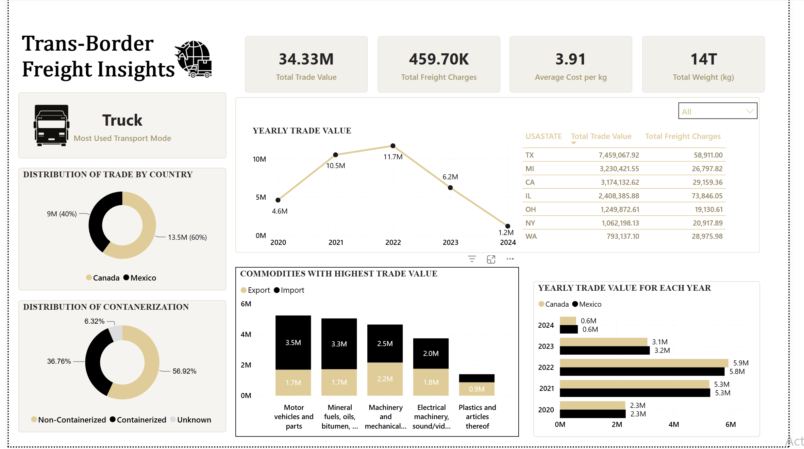

# 🇺🇸 US-Canada-Mexico Transborder Freight Analysis

This project explores, cleans, and analyzes the **Transborder Freight Dataset** to derive insights on goods movement by different transport modes (truck, rail, air, pipeline, vessel) across the U.S., Canada, and Mexico. The final outcome is a minimal, modern Power BI dashboard presenting the key findings visually.

## Power BI Dashboard

  

## Project Structure

```
transborder-freight-analysis
├── notebook               # Jupyter notebooks for data exploration and EDA
│   └── freight_analysis.ipynb
├── powerbi                  # Power BI file and image
│   └── freight_dashboard.pbix
│   └── freight_analysis_dashboard.png
├── .gitignore                 # Files and directories to be ignored by Git
├── requirements.txt          # Python package dependencies

```

## Objectives

- Understand and transform the raw Transborder Freight data
- Extract and analyze monthly freight movement patterns
- Compare shipment values by transport mode and country
- Visualize trends through Power BI with interactive filters

## Tools and Technologies

- Python (Pandas, Matplotlib, Numpy)
- Power BI
- Jupyter Notebook / VS Code
- Git & GitHub

## Key Insights

- Monthly shipment values are highest in [Insert month after analysis]
- The U.S. trades most by **truck** followed by **rail**
- [Insert more if needed]

## How to Use

1. Clone this repo  
   ```bash
   git clone https://github.com/paulabesst/transborder-freight-analysis.git
   ```

2. Navigate into the folder  
   ```bash
   cd transborder-freight-analysis
   ```

3. Install dependencies  
   ```bash
   pip install -r requirements.txt
   ```

4. Run the Python analysis  
   ```bash
   python freight_analysis.py
   ```

5. Open the `.pbix` file in Power BI Desktop to explore the dashboard

## Features of the Power BI Dashboard

- Slicers for:
  - **Year**

- Visuals include:
  - Bar Charts: Top countries and commodities
  - Line Charts: Trade value trends over time
  - Table: Freight Trade Value for US States
  - Pie Chart: Trade type(Import or Export) distribution
  - Card visuals for Total trade value, freight charges and average cost per kg


